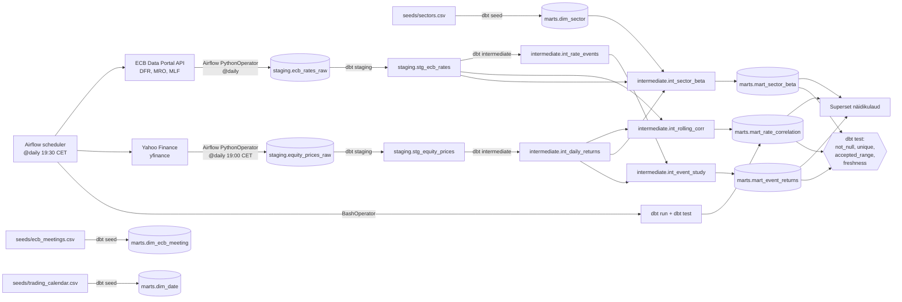

# Arhitektuur

## Äriküsimus

Kuidas on Euroopa Keskpanga (EKP) intressimäärade muutused seotud Euroopa aktsiaindeksite tootlusega ja sektorite käitumisega ning millised sektorid on rahapoliitika muutustele kõige tundlikumad?

## Mõõdikud

1. **Liikuv korrelatsioon EKP hoiustamise püsivõimaluse intressi (DFR) ja indeksi tootluse vahel.** Iga kauplemispäeva kohta arvutame 90-päevase rullaknaga Pearsoni korrelatsiooni DFR-i päevase muutuse (Δrate, baaspunktides) ja indeksi (STOXX Europe 600) päevase logaritmilise tootluse vahel. Tulemus on ajaseeria väärtustega vahemikus [-1, 1], mida saab näidikulaual ajas joonistada.
2. **Sektori intressitundlikkuse beta (β_rate).** Iga STOXX 600 sektori (Banks, Technology, Utilities, Real Estate, Energy, Healthcare jne) kohta arvutame OLS-regressiooni `sektor_return = α + β_market · STOXX_return + β_rate · Δrate + ε` rullaknaga 252 kauplemispäeva (≈ 1 aasta). β_rate näitab, kui palju sektori tootlus reageerib 1 baaspunktise intressimuutuse korral, kui on kontrollitud üldise turu mõju eest.
3. **Keskmine 30-päevane sündmusjärgne tootlus pärast EKP otsust (event study).** Klassifitseerime iga EKP rahapoliitika otsuse hikeks (DFR tõus ≥ +10 bp), cutiks (DFR langus ≤ -10 bp) või holdiks. Iga sündmuse järel arvutame järgneva 30 kalendripäeva kumulatiivse tootluse iga indeksi/sektori jaoks ning näitame keskmise hike vs cut võrdluse näidikulaual.

## Andmeallikad

| Allikas | Tüüp | Ajas muutuv? | Roll |
|---------|------|--------------|------|
| **ECB Data Portal API** (`data-api.ecb.europa.eu/service/data/FM/...`) | Avalik REST API, JSON/CSV, võtmeta | Jah — DFR/MRO/MLF intressid uuenevad pärast iga EKP nõukogu otsust (~8 korda aastas), aga päringuid teeme iga päev, et saada uusim seis ja korrigeeritud read | Põhiandmevoog 1 — EKP rahapoliitika intressimäärad (DFR, MRO, MLF) |
| **Yahoo Finance** läbi `yfinance` Python-paketi | Avalik HTTP allikas (kasutab unofficial endpointi), võtmeta | Jah — päevased close-hinnad uuenevad iga kauplemispäev pärast turgude sulgemist (~18:00 CET) | Põhiandmevoog 2 — STOXX Europe 600 (^STOXX), EURO STOXX 50 (^STOXX50E) ja STOXX 600 sektoriindeksid (^SX7E, ^SX8E, ^SX86E jne) |
| `seeds/sectors.csv` | dbt seed | Ei — staatiline | STOXX 600 sektorite dimensioonitabel: ticker, sektori nimi, ICB klassifikatsioon |
| `seeds/ecb_meetings.csv` | dbt seed | Ei — staatiline (uuendame manuaalselt 2x aastas) | EKP nõukogu rahapoliitika koosolekute kalender, et eristada plaanitud sündmusi tavalisest mürast |
| `seeds/trading_calendar.csv` | dbt seed | Ei — staatiline | Euronexti kauplemispäevad / pühade nimekiri, et joondada DFR ja aktsiate kuupäevad |

## Andmevoog

## Andmebaasi kihid

Kasutame **medaljoni arhitektuuri** PostgreSQL-is, kus iga kiht on eraldi skeem:

| Kiht | Materiaalsus | Roll |
|------|--------------|------|
| `staging` (raw) | Tabel | Airflow Python tasks kirjutavad otse — toorandmed JSON / CSV vormis. Iga rida saab `ingested_at` ja `run_id` veeru, vanu read ei kustutata (append-only, ajaloo säilitamiseks). |
| `staging` (stg_*) | Vaade (dbt) | Tüübikorrektsioon, veerunimede normaliseerimine, duplikaatide eemaldamine viimaseima `run_id` järgi. |
| `intermediate` | Vaade (dbt) | Äriloogika: tootluste arvutus (log-returns), liikuv korrelatsioon, sektori beta regressioon, sündmuste klassifitseerimine (hike/cut/hold). |
| `marts` | Tabel (dbt, `materialized=table`) | Lõpptulemused, mida Superset päringuteeb. Tabelina kiirema dashboard'i renderdamise jaoks. |

**Idempotentsus:** iga Airflow käivitus saab uue `run_id`. Staging append-only, marts tabelid `full-refresh` igal käivitusel (mahud väikesed: ~10 aastat × 252 päeva × ~15 indeksit ≈ 40k rida). Kui sama päev pärida kaks korda, ei teki duplikaate — `dbt build` arvutab kõik üle viimase `run_id` põhjal.

## Tööjaotus

| Roll | Vastutus | Täitja |
|------|----------|--------|
| Andmeallika omanik (EKP) | Airflow DAG `ecb_rates_ingest`, ECB API päringud, vea käsitlus, retry-loogika | [Nimi 1] |
| Andmeallika omanik (aktsiad) | Airflow DAG `equity_prices_ingest`, yfinance integratsioon, tickerite haldus, kauplemispäevade kontroll | [Nimi 2] |
| Transformatsioonide omanik | dbt staging + intermediate + marts mudelid, mõõdikute arvutuse loogika (rullkorrelatsioon, regressioon, event study) | [Nimi 3] |
| Kvaliteedi + näidikulaua omanik | dbt schema.yml testid (≥ 5 tk), Superset dashboard'i ehitus ja sidumine äriküsimusega, README | [Nimi 4] |

> Pair-review: kvaliteedi omanik vaatab läbi iga PR-i enne master'isse merge'imist. Iga liige teeb vähemalt ühe code review nädalas.

## Riskid

| Risk | Mõju | Maandus |
|------|------|---------|
| **EKP intress muutub harva (~8 sündmust aastas).** Liikuva korrelatsiooni nimetaja võib olla peaaegu null — väike standardhälve toodab müra ja äärmuslikke korrelatsiooniväärtusi. | Mõõdik 1 võib näidata mõttetuid hüppeid; sektori beta (mõõdik 2) võib olla suure standardveaga. | (a) Kasutame **Δrate baaspunktides**, mitte taset; (b) anname β_rate kõrval ka p-väärtuse ja R²; (c) marts tabelis lisame `n_rate_changes_in_window` veeru, et dashboard'is filtreerida välja aknad, kus muutusi liiga vähe. |
| **yfinance on mitteametlik allikas.** Yahoo võib endpointi muuta või rate-limit'i kehtestada, mistõttu päringud ebaõnnestuvad. | Päevased hinnad puuduvad, Airflow task ebaõnnestub. | (a) Airflow `retries=3, retry_delay=10min`; (b) varuallikas Stooq CSV (`https://stooq.com/q/d/?s=^stoxx&i=d`) — implementeerime fallback'i sprindis 3; (c) staging on append-only, üks vahelejäänud päev ei riku ajalugu. |
| **Kauplemispäevade ja kalendripäevade joondamine.** EKP DFR muutus võib jõustuda mitte-kauplemispäeval (näiteks 1. mai), aktsiahinnad puuduvad → join annab NULL. | Eventstudy ja korrelatsiooni mõõdikud kaotavad ridu või arvutavad valesti. | `dim_date` seedis on iga kalendripäev koos `is_trading_day` lipuga. DFR forward-fill'itakse kauplemispäevadele, sündmuse efektiivne kuupäev nihutatakse järgmisele kauplemispäevale. |
| **Sektoriindeksite ajalugu ja koosseisu muutused.** STOXX 600 sektorite definitsioon ja ticker'id on aja jooksul muutunud (näiteks ICB klassifikatsiooni uuendused 2019, 2021); ajalooline beta ei pruugi olla võrreldav. | Mõõdik 2 võib peegeldada indeksi koosseisu muutust, mitte rahapoliitika reaktsiooni. | Piirame analüüsi 2015. aastast alates (post-NIRP). `dim_sector` seedis dokumenteerime ticker'i kehtivuse perioodi (`valid_from`, `valid_to`). |

## Privaatsus ja turve

Projekt kasutab eranditult avalikke andmeid (EKP statistika, börsil noteeritud indeksite hinnad). Isikuandmeid ei koguta ega töödelda — GDPR ei kohaldu.

- PostgreSQL kasutajanimi ja parool, Airflow Fernet võti ja Superset secret key on `.env` failis. `.env` on `.gitignore`-s; reposse on commit'itud `.env.example` näidisväärtustega.
- Repo on **avalik** GitHubis, sest kõik andmed on avalikud.
- yfinance ja ECB API ei vaja võtmeid, kuid jätame `.env`-i tühja `EOD_API_KEY` rea juhuks, kui sprindis 3 vahetame allika.
- Docker Compose käivitab PostgreSQL-i, Airflow'i ja Superset'i lokaalselt; ühtegi porti väljapoole ei avata.
